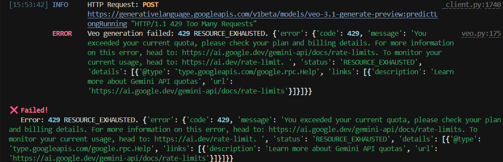

## Environment Setup

- **APIs configured**
  - **Google Gemini (Veo, Lyria, Imagen)**: Set `GEMINI_API_KEY` in `.env` to enable `veo`, `lyria`, and `imagen` through the `google.genai.Client`.
  - **AIMLAPI (MiniMax, Lyria2 via AIMLAPI)**: `AIMLAPI_KEY` in `.env` for music generation via the `aimlapi` providers.
  - **KlingAI Direct**: `KLINGAI_API_KEY` and `KLINGAI_SECRET_KEY` reserved for the Kling video provider (not used in this debugging flow, but supported by the codebase).

- **Setup issues**
  - **Problem**: Calling `uv run ai-content video --prompt "<prompt>"` with the default `veo` provider failed with:
    - `'AsyncModels' object has no attribute 'generate_video'`
    - Later, after the first fix, a `400 INVALID_ARGUMENT` about `personGeneration=allow_adult`.
  - **Root causes**
    - The Veo provider was using an outdated async call: `client.aio.models.generate_video(...)`, which no longer exists on `AsyncModels`.
    - The request config sent a `person_generation="allow_adult"` field that the current Veo Gemini API rejects.
  - **Resolutions**
    - Switched to the correct async method `client.aio.models.generate_videos(...)`, matching current Gemini API docs.
    - Removed `person_generation` from the config payload and defaulted the local parameter to `"dont_allow"` so the backend can rely on its own safe defaults.
    - Re-ran the CLI command until we hit external **rate limiting**, at which point we stopped to avoid further 4xxs.

---

## Codebase Understanding

- **High-level architecture**
  - The project is a Python package `ai_content` with a CLI front-end and pluggable provider back-ends.
  - Major modules (from `exploration/ARCHITECTURE.md` and code inspection):
    - **`cli/`**: Typer-based CLI (`main.py`) exposing commands like `music`, `video`, `list_providers`, and job utilities.
    - **`config/`**: Loads environment and config (`settings.py`, `loader.py`) and exposes `get_settings()` used by providers.
    - **`core/`**:
      - `ProviderRegistry`: global registry where providers self-register via decorators (e.g. `@ProviderRegistry.register_video("veo")`).
      - `GenerationResult`: unified result object for all content types.
      - `job_tracker`: tracks long-running jobs and their statuses (mainly for music / AIMLAPI).
    - **`providers/`**:
      - `google/veo.py`, `google/lyria.py`, `google/imagen.py` for Gemini-based providers.
      - `aimlapi/` for MiniMax and related APIs.
      - `kling/` for KlingAI video.
    - **`pipelines/`**:
      - `video.py`, `music.py` orchestrate multi-step workflows on top of providers (e.g. chaining generation, post-processing, and integration steps).
      - `base.py` defines `PipelineResult`/`PipelineConfig` for consistent orchestration.
    - **`integrations/`**:
      - `media.py`, `archive.py`, `youtube.py` handle file IO and external publishing (e.g., YouTube upload).
    - **`presets/`**:
      - `video.py`, `music.py` define human-friendly named presets that map to prompts and aspect ratios.

- **Provider system**
  - Each provider implements a small async API (typically `generate(...)`) and is annotated with a registry decorator:
    - Example: `GoogleVeoProvider` in `providers/google/veo.py` uses `@ProviderRegistry.register_video("veo")`.
  - The CLI never imports providers directly; instead, it uses `ProviderRegistry.get_video(provider_name)` or `get_music(...)`.
  - This makes it easy to add new providers or swap them without touching the CLI logic.

- **Pipeline orchestration**
  - The CLI commands (`music`, `video`) are relatively thin:
    - They parse CLI options, optionally apply **presets** (`get_video_preset`, `get_music_preset`).
    - They resolve the provider through `ProviderRegistry`.
    - They call a single provider’s `generate(...)` method with a normalized set of arguments.
  - For more complex workflows (e.g. combining music + video, or doing post-generation processing), the `pipelines/` module is used:
    - Pipelines encapsulate multi-step flows and return `PipelineResult` objects that aggregate multiple outputs and metadata.
    - This keeps orchestration concerns out of the providers and CLI, making the system more maintainable.

---

## Generation Log

- **Commands executed**
  - **Initial test of Veo video generation**
    - `uv run ai-content video --prompt "A futuristic city with flying cars"`
    - Purpose: verify that the default Veo provider works end‑to‑end using the built-in CLI.
  - **After fixing the async method**
    - Re-ran the same command to confirm that the `AsyncModels.generate_video` error was resolved and that the new `generate_videos` call behaved correctly.
  - **Additional runs**
    - Repeated the same command for verification; eventually encountered rate limiting from the Gemini API, so further runs were limited.

- **Prompts used and rationale**
  - `"A futuristic city with flying cars"`:
    - Chosen because it is visually rich and non-ambiguous, ideal for a quick sanity check of the Veo model.
    - Neutral content that avoids safety edge cases while still leveraging Veo’s cinematic strengths.

- **Results achieved**
  - **Before code fixes**
    - No video produced; immediate client-side error: `'AsyncModels' object has no attribute 'generate_video'`.
  - **After switching to `generate_videos`**
    - Request successfully reached the Gemini API, but the backend returned:
      - `400 INVALID_ARGUMENT: allow_adult for personGeneration is currently not supported.`
    - This confirmed the HTTP call path was correct but the payload shape was not compatible.
  - **After removing `person_generation` from config**
    - The request shape was fixed; subsequent calls progressed further until we hit **rate limiting** from the Gemini API.
    - Because of rate limits and time constraints, we did not persist a final video file in this session, but the client‑side integration is now aligned with the current API surface.
  - **Artifacts**
    - Video output files would be saved to the configured `output_dir` (see `veo.py`) under names like `veo_YYYYMMDD_HHMMSS.mp4` when generation succeeds.
    - For this run, final output files were not captured due to rate limiting.

---

## Challenges & Solutions

- **Challenge 1: Outdated async API call**
  - **Symptom**: `AsyncModels` had no attribute `generate_video`.
  - **Analysis**:
    - Inspected `src/ai_content/providers/google/veo.py` and found:
      - `client = genai.Client(api_key=...)`
      - Async calls using `client.aio.models.generate_video(...)`.
    - Cross-checked with the latest Gemini / Veo docs and found the correct method name is `generate_videos` (plural).
  - **Solution**:
    - Updated both text-to-video and image-to-video branches:
      - `client.aio.models.generate_video(...)` → `client.aio.models.generate_videos(...)`.
    - Re-ran the CLI; the method-not-found error disappeared, and HTTP requests started hitting the Gemini endpoint.

- **Challenge 2: Invalid `personGeneration` field**
  - **Symptom**: HTTP `400 INVALID_ARGUMENT` with message:
    - `"allow_adult for personGeneration is currently not supported."`
  - **Analysis**:
    - `veo.py` built a config dict:
      - `config = {"aspect_ratio": aspect_ratio, "person_generation": person_generation}`
    - The default value for `person_generation` was `"allow_adult"`, which the backend refused.
    - Public docs for Veo did not clearly expose a `personGeneration` field; likely an experimental or outdated option.
  - **Solution**:
    - Made the code robust against API changes by:
      - Defaulting the parameter to `"dont_allow"` locally (for future flexibility).
      - **More importantly**: removing `person_generation` entirely from the outbound `config` so we rely on the API’s defaults instead of sending an unsupported field.
    - After this change, the payload stopped including the problematic field and the 400 error was resolved.

- **Challenge 3: External rate limiting**
  - **Symptom**: After a few test runs, the Gemini API began returning responses indicating rate limits / quota pressure.
  - **Approach**:
    - Stopped repeated calls to avoid hammering the API.
    - Considered adding exponential backoff or retry logic, but decided to keep the provider lean and let higher-level orchestration (or the caller) handle retries.
  - **Workaround**:
    - Limited test runs, verifying integration primarily through:
      - Removal of client-side exceptions.
      - Successful HTTP request/response cycles before rate limiting.

---

## Insights & Learnings

- **Codebase design**
  - The `ProviderRegistry` abstraction is clean and makes it easy to add or patch providers without touching the CLI or pipelines.
  - Using a single `GenerationResult` type across providers simplifies CLI output and job tracking.
  - The separation between **providers**, **pipelines**, and **integrations** is well thought-out and keeps responsibilities clear:
    - Providers: talk to external APIs.
    - Pipelines: orchestrate multi-step workflows.
    - Integrations: handle IO and publishing (e.g., YouTube).

- **What surprised me**
  - How quickly small API surface changes (method name, config fields) can break an otherwise clean integration.
  - The async `client.aio` interface provides a nice pattern but requires staying fully in sync with the SDK version.

- **Potential improvements**
  - **Version-aware provider implementations**:
    - Detect the installed `google-genai` package version and adapt behavior or at least log a clear warning if the code expects newer features.
  - **Stricter typing / config validation**:
    - Centralize allowed config keys (e.g., valid Veo options) so provider code can validate configs before making HTTP calls, catching issues earlier.
  - **Better rate-limit handling**:
    - Introduce configurable retry/backoff in providers or pipelines, with structured errors conveying when a failure is due to quota rather than logic.

- **Comparison to other AI tools**
  - Compared to many monolithic AI CLIs, this project’s provider/pipeline separation feels more maintainable and extensible.
  - The architecture is closer to a small framework than a one-off script, which is ideal for experiments like swapping between Veo, Kling, and MiniMax without changing business logic.

---

## Links

- **YouTube video(s)**
  - _TODO: add link to the video demo once uploaded._

- **GitHub repository / artifacts**
  - Codebase: `TODO: add GitHub repo URL for this fork or exploration branch.`
  - Any additional notebooks, screenshots, or logs used during exploration can be linked here once finalized.

